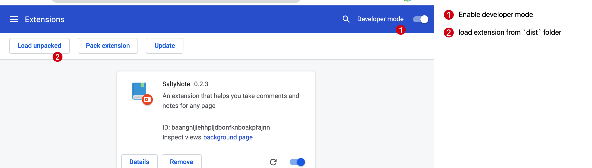

# SaltyNote <small>Chrome Extension</small>

> Check [zhouhao/saltynote-chrome-extension-cloudflare](https://github.com/zhouhao/saltynote-chrome-extension-cloudflare) for further updates.

`SaltyNote` can be a very useful **Chrome Extension**, with which, you can easily annotate any text in any page with your comments.

> [Website](https://saltynote.com/)
> 
> [Chrome Web Store](https://chrome.google.com/webstore/detail/saltynote/baanghljiehhpljdbonfknboakpfajnn)
> 
> [Documentation](https://saltynote.github.io/saltynote-chrome-extension/) & [Blog Post](https://hzhou.me/2023/04/22/saltynote-implementation-chrome-extension/)

## Overview

## Get Started

1. Make a copy of [`env.example.json`](./env.example.json), and rename it to `env.json`.
1. Make a copy of [`src/icons-example`](./src/icons-example), and rename it to `src/icons`.
1. Run `npm run build`, then a `dist` folder will be generated.
1. Go to [chrome://extensions/](chrome://extensions/) page in Chrome, enable `developer mode`, and load the extension from [`dist`](./dist) folder.
   

## License

MIT
