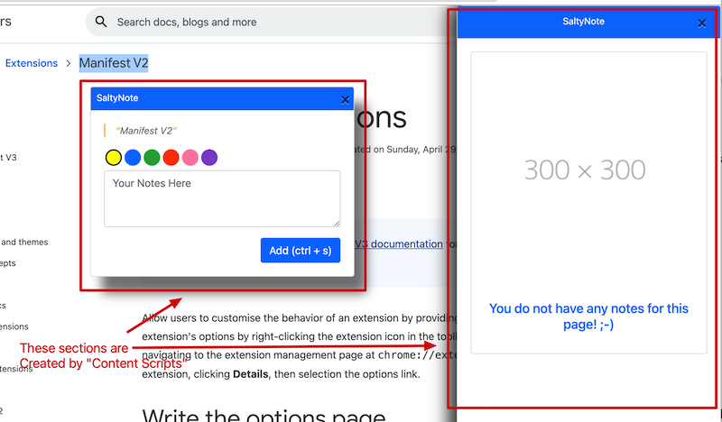
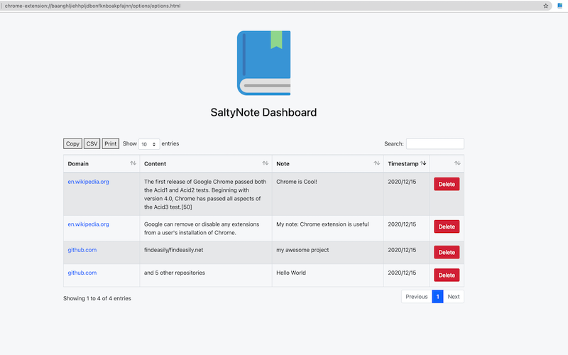

**disclaimer**: This document is more about my personal understanding about [Chrome Extension](https://developer.chrome.com/docs/extensions/). Please feel free to correct me by opening an issue if you
see anything wrong.

### Chrome Extension has 3 parts:

1. [Content Scripts](#content-scripts)
2. [Background Scripts](#background-scripts)
3. [Options Page](#options-page)

## [Content Scripts](https://developer.chrome.com/docs/extensions/mv2/content_scripts/)

> Content scripts are files that run in the context of web pages.

As a screenshot below, the right sidebar and annotation popup window are created by `Content Scripts`.

In saltynote extension, the `Content Scripts` will not interact with saltynote service directly. Instead, it will send different types of [messages](https://developer.chrome.com/docs/extensions/mv2/messaging/) to `Background Scripts`, then `Background Scripts`
will send corresponding requests to service, and pass service response to `Content Scripts` through messages.

## [Background Scripts](https://developer.chrome.com/docs/extensions/mv2/background_pages/)

`Background Scripts` are used to handle browser events. In saltynote extension, it will:

1. listen to events created by `Content Scripts`
2. Interact with saltynote service for data exchange

## [Options Page](https://developer.chrome.com/docs/extensions/mv2/options/)

`Options Page` works simply as general web page embedded in extension.
It is used to `allow users to customise the behavior of an extension by providing an options page`,
but in saltynote extension, we use it as a dashboard, where users can view all theirs page annotations, and manage them.

